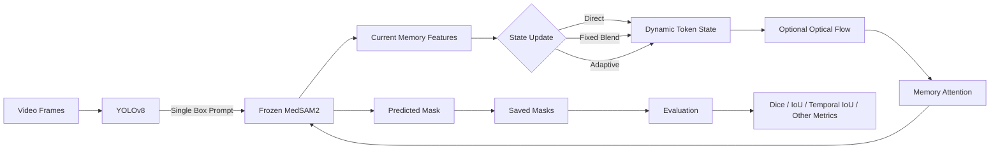

# AdeSEG

**Training-free dynamic temporal memory for frozen MedSAM2 video segmentation.**

AdeSEG investigates whether a compact recurrent spatial state can improve **video polyp segmentation** with a frozen MedSAM2 model.

Instead of keeping the full native spatial-memory queue, AdeSEG maintains a single evolving **dynamic token state**. The state is initialized from one YOLO box prompt, optionally aligned between frames with optical flow, and updated after each prediction.

No MedSAM2 weights are fine-tuned.

---

## Architecture



For each video:

1. YOLO searches for the first valid polyp detection and provides **one box prompt**.
2. The prompted frame initializes the dynamic token state.
3. For each following frame:
   - the previous state can be aligned using optical flow;
   - the state is passed through MedSAM2 memory attention;
   - MedSAM2 predicts the current mask;
   - the new memory features update the recurrent state.
4. Predicted masks are saved and evaluated against PolypGen ground truth.

---

## Dynamic State

AdeSEG supports three state-update strategies.

| Mode | Description |
|---|---|
| `direct` | Replace the previous state with the current memory features. |
| `fixed` | Blend old and new states using a fixed weight. |
| `adaptive` | Adjust the update weight using prediction reliability and temporal/foreground consistency. |

The state can also be spatially aligned using Farnebäck optical flow:

```bash
--motion_alignment flow
```

or used without alignment:

```bash
--motion_alignment none
```

The implementation is currently designed for **forward, single-object video segmentation with one initial prompt**.

---

## Repository Structure

```text
AdeSEG/
├── infer.py
│
├── modeling/
│   ├── fusion.py
│   └── reliability_gate.py
│
├── utils/
│   ├── eval.py
│   ├── eval_metrics.py
│   ├── mask_utils.py
│   ├── model_defaults.py
│   └── create_polypgen_anchor_masks.py
│
├── MedSAM2/
│   ├── sam2/
│   ├── medsam2_infer_video.py
│   ├── medsam2_infer_video_adenoid.py
│   └── ...
│
├── requirements.txt
└── README.md
```

### Main components

- **`infer.py`** — main dynamic-token video inference pipeline.
- **`modeling/fusion.py`** — recurrent spatial state, optical-flow alignment, memory attention, and state fusion.
- **`modeling/reliability_gate.py`** — reliability calculation used by the adaptive update.
- **`utils/eval.py`** — PolypGen evaluation and visualization.
- **`utils/eval_metrics.py`** — segmentation metrics.
- **`MedSAM2/`** — MedSAM2/SAM2 implementation used by the pipeline.

---

## Installation

Clone the repository:

```bash
git clone https://github.com/aCoderChild/AdeSEG.git
cd AdeSEG
```

Create a virtual environment:

```bash
python -m venv .venv
source .venv/bin/activate
```

Install dependencies:

```bash
pip install -r requirements.txt
```

AdeSEG supports:

```text
cuda    NVIDIA GPU
mps     Apple Silicon
cpu     CPU inference
```

---

## Checkpoints

By default, `infer.py` expects:

```text
checkpoints/
├── MedSAM2_latest.pt
└── polypgen_yolov8n.pt
```

Custom checkpoints can be provided using:

```bash
--sam2_checkpoint /path/to/MedSAM2.pt
--yolo_checkpoint /path/to/yolo.pt
```

Model weights are not tracked by Git.

---

## Dataset

The default evaluation dataset is **PolypGen2021**.

Expected structure:

```text
data/
└── PolypGen2021_MultiCenterData_v3/
    └── sequenceData/
        └── positive/
            ├── seq1/
            │   ├── images_seq1/
            │   └── masks_seq1/
            ├── seq2/
            │   ├── images_seq2/
            │   └── masks_seq2/
            └── ...
```

Dataset files are not included in the repository.

---

## Inference

### Basic

```bash
python infer.py \
  -i data/PolypGen2021_MultiCenterData_v3/sequenceData/positive \
  -o outputs/DynamicToken_YOLO/masks \
  --device mps
```

Use `cuda` on an NVIDIA machine:

```bash
--device cuda
```

### Run selected sequences

```bash
python infer.py \
  -i data/PolypGen2021_MultiCenterData_v3/sequenceData/positive \
  -o outputs/DynamicToken_YOLO/masks \
  --seq_nums 1 2 3 4 5 \
  --device mps
```

### Direct state + optical flow

```bash
python infer.py \
  -i data/PolypGen2021_MultiCenterData_v3/sequenceData/positive \
  -o outputs/direct_flow/masks \
  --memory_update direct \
  --motion_alignment flow \
  --device mps
```

### Fixed state blending

```bash
python infer.py \
  -i data/PolypGen2021_MultiCenterData_v3/sequenceData/positive \
  -o outputs/fixed_flow/masks \
  --memory_update fixed \
  --fixed_memory_weight 0.5 \
  --motion_alignment flow \
  --device mps
```

### Adaptive state update

```bash
python infer.py \
  -i data/PolypGen2021_MultiCenterData_v3/sequenceData/positive \
  -o outputs/adaptive_flow/masks \
  --memory_update adaptive \
  --motion_alignment flow \
  --device mps
```

---

## Important Arguments

| Argument | Description |
|---|---|
| `-i`, `--base_video_dir` | Input video-sequence directory |
| `-o`, `--output_mask_dir` | Output directory for predicted masks |
| `--seq_nums` | Run only selected sequence numbers |
| `--device` | `cuda`, `mps`, or `cpu` |
| `--yolo_conf` | YOLO confidence threshold |
| `--yolo_imgsz` | YOLO inference resolution |
| `--video_prompt_stride` | Interval between candidate frames searched for the initial YOLO prompt |
| `--memory_update` | `direct`, `fixed`, or `adaptive` |
| `--motion_alignment` | `flow` or `none` |
| `--fixed_memory_weight` | State blending weight for `fixed` mode |
| `--token_write_rate` | Minimum state update rate for adaptive mode |
| `--fixed_reliability` | Optional fixed reliability value for controlled experiments |

Run:

```bash
python infer.py --help
```

for the full list.

---

## Evaluation

After inference:

```bash
python utils/eval.py \
  --output_mask_dir outputs/DynamicToken_YOLO/masks \
  --data_root data/PolypGen2021_MultiCenterData_v3/sequenceData/positive \
  --output_eval_dir outputs/DynamicToken_YOLO/evaluation
```

You can evaluate selected sequences only:

```bash
python utils/eval.py \
  --output_mask_dir outputs/DynamicToken_YOLO/masks \
  --data_root data/PolypGen2021_MultiCenterData_v3/sequenceData/positive \
  --output_eval_dir outputs/DynamicToken_YOLO/evaluation \
  --sequences seq1 seq2 seq3
```

The evaluator reports:

- Dice
- IoU
- F1 / F-measure
- F2
- Precision
- Recall
- Sensitivity
- Specificity
- Accuracy
- MAE
- Temporal IoU

It generates both **frame-level** and **sequence-level** statistics.

---

## Output

A typical experiment produces:

```text
outputs/
└── DynamicToken_YOLO/
    ├── masks/
    │   ├── seq1/
    │   ├── seq2/
    │   ├── ...
    │   ├── diagnostics/
    │   └── run_manifest.json
    │
    └── evaluation/
        ├── metrics_per_frame.csv
        ├── metrics_per_sequence.csv
        ├── metrics_stats.csv
        └── overlays/
```

`run_manifest.json` records the inference configuration and source hashes for experiment reproducibility.

Per-frame diagnostics also record quantities such as predicted IoU, object probability, reliability, state write weight, temporal consistency, and optical-flow validity.

---

## End-to-End Example

```bash
OUTPUT="outputs/DynamicToken_YOLO"
DATA="data/PolypGen2021_MultiCenterData_v3/sequenceData/positive"

python infer.py \
  -i "$DATA" \
  -o "$OUTPUT/masks" \
  --memory_update adaptive \
  --motion_alignment flow \
  --device mps \
&& \
python utils/eval.py \
  --output_mask_dir "$OUTPUT/masks" \
  --data_root "$DATA" \
  --output_eval_dir "$OUTPUT/evaluation"
```

Using `&&` ensures evaluation only starts after inference completes successfully.

---

## Research Scope

AdeSEG is an **experimental research codebase**, not a clinical system.

The main research question is:

> Can a single recurrent spatial state provide useful temporal memory for frozen MedSAM2 video segmentation without additional model training?

The current implementation is intended for controlled experimentation with dynamic memory updates, motion alignment, and temporal segmentation behavior.

---

## Acknowledgements

AdeSEG builds on **MedSAM2 / SAM2** and uses **Ultralytics YOLO** for automatic box prompting.

Please refer to the corresponding projects and the license included under `MedSAM2/` when using their components.
