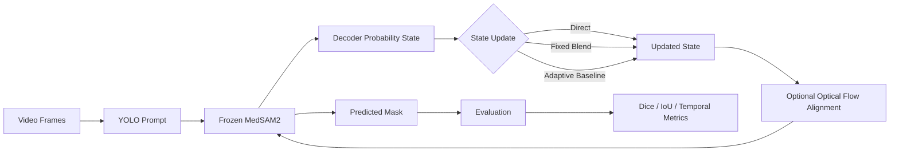

# AdeSEG

AdeSEG is a research codebase for **video polyp segmentation with frozen MedSAM2**.

The main goal is to test whether a lightweight **dynamic temporal state** can improve segmentation under sparse prompting without fine-tuning MedSAM2.

The main method is training-free and does **not** modify MedSAM2 weights.

---

## Architecture



Simplified pipeline:

```text
Video
  ↓
YOLO prompt
  ↓
Frozen MedSAM2
  ↓
Prediction + temporal state
  ↓
Optional optical-flow alignment
  ↓
Next frame
  ↓
Predicted masks
  ↓
Evaluation
```

---

## Repository structure

```text
AdeSEG/
├── infer.py
├── utils/
│   └── eval.py
├── reliability_method/
│   └── reliability_gated_video_memory_experiment.py
├── experiments/
│   ├── summarize_state_ablation.py
│   ├── native_single_state_memory.py
│   ├── summarize_native_single_state.py
│   └── train_causal_prompt_adapter.py
├── modeling/
│   └── causal_prompt_adapter.py
├── research/
├── results/
├── tests/
└── data/
```

### Main components

- `infer.py` — main video inference pipeline.
- `utils/eval.py` — evaluates predicted masks.
- `reliability_method/` — dynamic-state experiments.
- `experiments/` — ablations and comparison experiments.
- `modeling/` — learned causal prompt adapter.
- `research/` — research decisions and verification plans.
- `results/` — saved experiment results.

---

## Main inference

Activate the environment:

```bash
cd /Users/maianhpham/Documents/AdeSEG
source .venv/bin/activate
```

Run inference:

```bash
python infer.py \
  -i data/PolypGen2021_MultiCenterData_v3/sequenceData/positive \
  -o outputs/DynamicToken_YOLO/masks \
  --device mps
```

On NVIDIA GPUs, use:

```bash
--device cuda
```

---

## Evaluation

```bash
python utils/eval.py \
  --output_mask_dir outputs/DynamicToken_YOLO/masks \
  --data_root data/PolypGen2021_MultiCenterData_v3/sequenceData/positive \
  --output_eval_dir outputs/DynamicToken_YOLO/evaluation
```

Output structure:

```text
outputs/
└── DynamicToken_YOLO/
    ├── masks/
    └── evaluation/
```

---

## Dynamic state settings

### Direct update

```bash
--memory_update direct
```

Uses the newest decoder state directly.

### Fixed blending

```bash
--memory_update fixed
--fixed_memory_weight 0.5
```

Blends the previous and current state using a fixed weight.

### Adaptive baseline

```bash
--memory_update adaptive
```

Legacy reliability-based state update.

### Optical-flow alignment

```bash
--motion_alignment flow
```

Aligns the previous state with the current frame before reuse.

Example:

```bash
python infer.py \
  -i data/PolypGen2021_MultiCenterData_v3/sequenceData/positive \
  -o outputs/direct_flow/masks \
  --device mps \
  --memory_update direct \
  --motion_alignment flow \
  --video_prompt_stride 5
```

---

## Current evidence

The main controlled experiment covers **23 PolypGen sequences**.

The best reliability-free setting so far is:

```text
Direct state + optical flow
```

Observed Dice gains:

```text
Stride 5:   +0.006
Stride 10:  +0.011
```

However, the paired 95% bootstrap intervals include zero.

These results should therefore be treated as an **early ablation**, not yet as evidence of a statistically reliable improvement.

Results:

```text
results/state_ablation/comparison.json
```

Summarize them with:

```bash
python experiments/summarize_state_ablation.py
```

---

## Additional experiments

### Single-state native memory

Tests whether full MedSAM2 memory can be replaced by one mutable state.

```bash
python experiments/native_single_state_memory.py \
  --variant single_state_flow \
  --prompt-stride 5

python experiments/summarize_native_single_state.py
```

Current results do **not** support replacing the full native memory bank.

### Learned causal prompt adapter

A separate experiment disables native memory and learns a causal-state adapter while keeping MedSAM2 frozen.

```bash
python experiments/train_causal_prompt_adapter.py \
  train \
  --device mps \
  --epochs 10
```

This is experimental and is separate from the main training-free method.

---

## Evaluation protocol

Reported Dice and IoU are averaged **per video**, not per frame:

\[
\text{Mean Dice}
=
\frac{1}{N}
\sum_{i=1}^{N}
\text{Dice}_i
\]

This gives each sequence equal weight regardless of video length.

---

## Tests

```bash
python -m pytest tests -q
```

---

## Research goal

The central question is:

> Can a lightweight causal decoder state improve sparse-prompt frozen MedSAM2 video segmentation without fine-tuning the model or using a hand-designed reliability score?

Current results are promising as an ablation, but stronger validation is still required before making a model-level claim.
