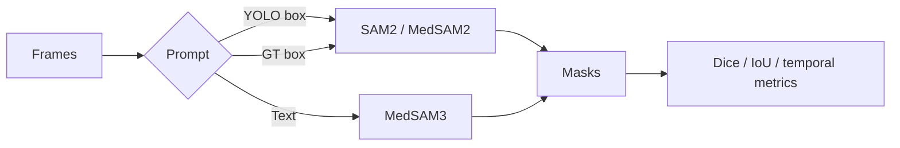

# AdeSEG

Prompt-guided endoscopy video segmentation with SAM2, MedSAM2, MedSAM3, and YOLO.

> PolypGen is a proxy benchmark. It is not clinical evidence for adenoid hypertrophy.

## Scope

| Track | Data | Purpose |
|---|---|---|
| Proxy benchmark | PolypGen, 23 sequences | Compare prompts, models, and propagation |
| Reliability gate | PolypGen, 2,225 frames | Test output-mask acceptance |
| Clinical target | Adenoid videos | Segment `adenoid` and `nasopharynx_airway` |



## Headline results

Sequence-macro averages from the Drive score exports:

| Method | Dice | IoU |
|---|---:|---:|
| SAM2 Large + GT box, frame | **0.9457** | **0.9071** |
| SAM2 + GT box, frame | 0.9415 | 0.9027 |
| SAM2 + YOLO box, frame | 0.7851 | 0.7511 |
| MedSAM2 + GT mask prompt, every frame | 0.7436 | 0.7069 |
| MedSAM3 + text `polyp` | 0.6663 | 0.6275 |

Reliability-gated, frame-macro results:

| Prompt stride | Dice | IoU | Temporal IoU | Prompts | Time |
|---:|---:|---:|---:|---:|---:|
| 1 | **0.6919** | **0.6499** | 0.6750 | 1,710 | 15m 57s |
| 5 | 0.6419 | 0.5948 | 0.6934 | 349 | 12m 45s |
| 10 | 0.6255 | 0.5769 | **0.7051** | 174 | **9m 53s** |

See [results](docs/RESULTS.md) for all 20 methods and gate diagnostics.

## Quick start

```bash
pip install -r requirements.txt
bash scripts/run_polypgen_experiment.sh --dry_run
bash scripts/run_polypgen_experiment.sh
```

| Task | Command |
|---|---|
| Prepare boxes | `bash scripts/run_polypgen_experiment.sh --stage prepare` |
| Infer | `bash scripts/run_polypgen_experiment.sh --stage infer` |
| Evaluate | `bash scripts/run_polypgen_experiment.sh --stage eval` |
| Select method | `bash scripts/run_polypgen_experiment.sh --methods YOLO_SAM2_YOLO_BOX_FRAME` |
| Select sequences | `bash scripts/run_polypgen_experiment.sh --seqs 1 2 3` |

## Required assets

| Path | Asset |
|---|---|
| `data/polypgen/seq*/images` | Benchmark frames |
| `data/polypgen/seq*/masks` | Ground-truth masks |
| `checkpoints/polypgen_yolov8n.pt` | YOLO |
| `checkpoints/MedSAM2_latest.pt` | SAM2 / MedSAM2 |
| `checkpoints/sam2_hiera_large.pt` | SAM2 Large |
| `checkpoints/MedSAM3_v1/best_lora_weights.pt` | Optional MedSAM3 LoRA |
| `checkpoints/facebook_sam3/sam3.pt` | Optional SAM3 base |

Large assets are not tracked by Git.

## Project map

| Path | Contents |
|---|---|
| `experiments/polypgen_medsam2_yolo_sam2.json` | Main benchmark config |
| `experiments/reliability_gated_memory_experiment.py` | Gated experiment |
| `scripts/experiments/run_experiment.py` | Orchestrator |
| `scripts/utils/eval_metrics.py` | Evaluation |
| `external/` | Model implementations |
| `outputs/` | Local results |

## Documentation

| Document | Use |
|---|---|
| [Experiments](docs/EXPERIMENTS.md) | Commands, methods, outputs |
| [Results](docs/RESULTS.md) | Benchmark and gated tables |
| [Technical](docs/TECHNICAL.md) | Architecture and gate logic |
| [Protocol](docs/PROTOCOL.md) | Clinical study design |

## Drive

| Folder | Contents |
|---|---|
| [AdeSEG](https://drive.google.com/drive/folders/1NMiVWai1_8xgT5qZ6Hb8v52xPYA_f48d) | Project files |
| [Logs](https://drive.google.com/drive/folders/1-oTZ4h7_47qXIjZOw6e0C3itfvgU8cnr) | Run logs |
| [Outputs](https://drive.google.com/drive/folders/11q_daWX4jO5XbvZ-PY9KWbIkx3XM7O2o) | Masks and results |
