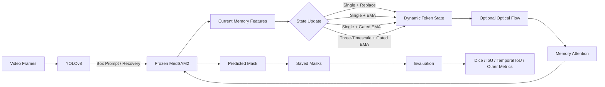

# AdeSEG

**Training-free dynamic temporal memory for frozen MedSAM2 video segmentation.**

AdeSEG investigates whether a compact recurrent spatial state can improve **video polyp segmentation** with a frozen MedSAM2 model.

Instead of keeping the full native spatial-memory queue, AdeSEG maintains a
compressed recurrent representation of past observations. The state is
initialized from a YOLO box prompt, optionally aligned between frames with
optical flow, and updated after each prediction; EMA updates progressively
forget older observations rather than retaining every historical frame.

No MedSAM2 weights are fine-tuned.

---

## Architecture


```mermaid
flowchart LR
    A[Video Frames] --> B[YOLOv8]
    B -->|Box Prompt / Recovery| C[Frozen MedSAM2]

    C --> D[Predicted Mask]
    C --> E[Current Memory Features]

    E --> F{State Update}
    F -->|Single + Replace| G[Dynamic Token State]
    F -->|Single + EMA| G
    F -->|Single + Gated EMA| G
    F -->|Three-Timescale + Gated EMA| G

    G --> H[Optional Optical Flow]
    H --> I[Memory Attention]
    I --> C

    D --> J[Saved Masks]
    J --> K[Evaluation]
    K --> L[Dice / IoU / Temporal IoU / Other Metrics]
```

For each video:

1. YOLO searches for the first valid polyp detection and provides the initial box prompt. Optional detector recovery can later re-prompt an inconsistent frame.
2. The prompted frame initializes one recurrent memory state.
3. For each following frame:
   - the state is passed through MedSAM2 memory attention;
   - MedSAM2 predicts the current mask;
   - the memory encoder produces the current candidate memory;
   - a learned gate uses predicted IoU, object probability, and state similarity;
   - the state is updated as `(1 - gate) * state + gate * candidate`.
4. Predicted masks are saved and evaluated against PolypGen ground truth.

---

## Learned Dynamic State

The main method has one recurrent spatial state. For each propagated frame,
MedSAM2 encodes a candidate memory feature and a small MLP predicts a scalar
update gate from predicted IoU, object probability, and state similarity:

```text
state = (1 - gate) * state + gate * candidate
```

The gate and state are trained together. Inference uses the same gate and
update equation. The learned path requires a checkpoint produced by the
dynamic-state training configuration.

The implementation is currently designed for **forward, single-object video segmentation**. It preloads each video and runs detector preprocessing before propagation, so it is causal but not a streaming or real-time VOS implementation.

---

## Repository Structure

```text
AdeSEG/
├── infer.py
│
├── modeling/
│   ├── fusion.py
│   └── reliability_gate.py
│
├── utils/
│   ├── eval.py
│   ├── eval_metrics.py
│   ├── mask_utils.py
│   ├── model_defaults.py
│   └── create_polypgen_anchor_masks.py
│
├── MedSAM2/
│   ├── sam2/
│   ├── medsam2_infer_video.py
│   ├── medsam2_infer_video_adenoid.py
│   └── ...
│
├── requirements.txt
└── README.md
```

### Main components

- **`infer.py`** — main dynamic-token video inference pipeline.
- **`modeling/fusion.py`** — recurrent spatial state, optical-flow alignment, memory attention, and state fusion.
- **`modeling/reliability_gate.py`** — reliability calculation used by the adaptive update.
- **`utils/eval.py`** — PolypGen evaluation and visualization.
- **`utils/eval_metrics.py`** — segmentation metrics.
- **`MedSAM2/`** — MedSAM2/SAM2 implementation used by the pipeline.

---

## Installation

Clone the repository:

```bash
git clone https://github.com/aCoderChild/AdeSEG.git
cd AdeSEG
```

Create a virtual environment:

```bash
python -m venv .venv
source .venv/bin/activate
```

Install dependencies:

```bash
pip install -r requirements.txt
```

AdeSEG supports:

```text
cuda    NVIDIA GPU
mps     Apple Silicon
cpu     CPU inference
```

---

## Checkpoints

By default, `infer.py` expects:

```text
checkpoints/
├── MedSAM2_latest.pt
└── polypgen_yolov8n.pt
```

Custom checkpoints can be provided using:

```bash
--sam2_checkpoint /path/to/MedSAM2.pt
--yolo_checkpoint /path/to/yolo.pt
```

Model weights are not tracked by Git.

---

## Dataset

The default evaluation dataset is **PolypGen2021**.

Expected structure:

```text
data/
└── PolypGen2021_MultiCenterData_v3/
    └── sequenceData/
        └── positive/
            ├── seq1/
            │   ├── images_seq1/
            │   └── masks_seq1/
            ├── seq2/
            │   ├── images_seq2/
            │   └── masks_seq2/
            └── ...
```

Dataset files are not included in the repository.

---

## Inference

### Basic

```bash
python infer.py \
  -i data/PolypGen2021_MultiCenterData_v3/sequenceData/positive \
  -o outputs/LearnedState_YOLO/masks \
  --device mps
```

Use `cuda` on an NVIDIA machine:

```bash
--device cuda
```

### Run selected sequences

```bash
python infer.py \
  -i data/PolypGen2021_MultiCenterData_v3/sequenceData/positive \
  -o outputs/LearnedState_YOLO/masks \
  --learned_checkpoint path/to/dynamic_state_checkpoint.pt \
  --seq_nums 1 2 3 4 5 \
  --device mps
```

### Compare native and learned memory

Run the learned model first; it writes `prompt_records.json`. Replay that file
with the native backend to use the same prompt frame and box.

```bash
python infer.py -i "$DATA" -o outputs/learned \
  --learned_checkpoint path/to/dynamic_state_checkpoint.pt --device mps
python infer.py -i "$DATA" -o outputs/native --memory_backend native \
  --prompt_records outputs/learned/prompt_records.json --device mps
```

---

## Important Arguments

| Argument | Description |
|---|---|
| `-i`, `--base_video_dir` | Input video-sequence directory |
| `-o`, `--output_mask_dir` | Output directory for predicted masks |
| `--seq_nums` | Run only selected sequence numbers |
| `--device` | `cuda`, `mps`, or `cpu` |
| `--yolo_conf` | YOLO confidence threshold |
| `--yolo_imgsz` | YOLO inference resolution |
| `--video_prompt_stride` | Interval between candidate frames searched for the initial YOLO prompt |
| `--memory_backend` | Native MedSAM2 memory bank or learned recurrent state |
| `--learned_checkpoint` | Dynamic-state training checkpoint, required for learned memory |
| `--prompt_records` | Saved prompt boxes to replay exactly in a comparison run |

Run:

```bash
python infer.py --help
```

for the full list.

---

## Evaluation

After inference:

```bash
python utils/eval.py \
  --output_mask_dir outputs/LearnedState_YOLO/masks \
  --data_root data/PolypGen2021_MultiCenterData_v3/sequenceData/positive \
  --output_eval_dir outputs/LearnedState_YOLO/evaluation
```

You can evaluate selected sequences only:

```bash
python utils/eval.py \
  --output_mask_dir outputs/LearnedState_YOLO/masks \
  --data_root data/PolypGen2021_MultiCenterData_v3/sequenceData/positive \
  --output_eval_dir outputs/LearnedState_YOLO/evaluation \
  --sequences seq1 seq2 seq3
```

The evaluator reports:

- Dice
- IoU
- F1 / F-measure
- F2
- Precision
- Recall
- Sensitivity
- Specificity
- Accuracy
- MAE
- Temporal IoU

Temporal IoU is an unregistered prediction-to-prediction stability diagnostic;
it does not establish temporal correctness because consistently wrong masks can
also have high overlap. It generates both **frame-level** and **sequence-level**
statistics.

---

## Output

A typical experiment produces:

```text
outputs/
└── LearnedState_YOLO/
    ├── masks/
    │   ├── seq1/
    │   ├── seq2/
    │   ├── ...
    │   ├── diagnostics/
    │   └── run_manifest.json
    │
    └── evaluation/
        ├── metrics_per_frame.csv
        ├── metrics_per_sequence.csv
        ├── metrics_stats.csv
        └── overlays/
```

`run_manifest.json` records the inference configuration and source hashes for experiment reproducibility.

Per-frame diagnostics record predicted IoU, object probability, state similarity, and the learned update weight.

---

## End-to-End Example

```bash
OUTPUT="outputs/LearnedState_YOLO"
DATA="data/PolypGen2021_MultiCenterData_v3/sequenceData/positive"

python infer.py \
  -i "$DATA" \
  -o "$OUTPUT/masks" \
  --learned_checkpoint path/to/dynamic_state_checkpoint.pt \
  --device mps \
&& \
python utils/eval.py \
  --output_mask_dir "$OUTPUT/masks" \
  --data_root "$DATA" \
  --output_eval_dir "$OUTPUT/evaluation"
```

Using `&&` ensures evaluation only starts after inference completes successfully.

---

## Research Scope

AdeSEG is an **experimental research codebase**, not a clinical system.

The main research question is:

> Can a single recurrent spatial state provide useful temporal memory for frozen MedSAM2 video segmentation without additional model training?

The current implementation is intended for controlled experimentation with dynamic memory updates, motion alignment, and temporal segmentation behavior.

---

## Acknowledgements

AdeSEG builds on **MedSAM2 / SAM2** and uses **Ultralytics YOLO** for automatic box prompting.

Please refer to the corresponding projects and the license included under `MedSAM2/` when using their components.
