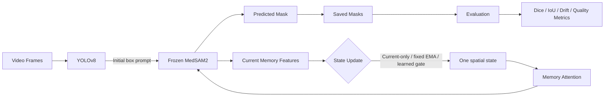

# AdeSEG

**Learned recurrent state for MedSAM2 video segmentation.**

AdeSEG investigates whether a compact recurrent spatial state can improve **video polyp segmentation** with a frozen MedSAM2 model.

AdeSEG compares MedSAM2's native memory bank with one recurrent spatial state.
The frozen MedSAM2 backbone produces a current memory candidate after each
mask prediction. A trainable two-input MLP estimates candidate quality and
combines it with MedSAM2's object probability to decide how much to write.

---

## Architecture


```mermaid
flowchart LR
    A[Video Frames] --> B[YOLOv8]
    B -->|Initial box prompt| C[Frozen MedSAM2]

    C --> D[Predicted Mask]
    C --> E[Current Memory Features]

    E --> F{State Update}
    F -->|Current-only / fixed EMA / learned gate| G[One spatial state]
    G --> H[Memory Attention]
    H --> C

    D --> J[Saved Masks]
    J --> K[Evaluation]
    K --> L[Dice / IoU / Drift / Quality Metrics]
```

For each video:

1. YOLO searches for the first valid polyp detection and provides the initial box prompt.
2. The prompted frame initializes one recurrent memory state.
3. For each following frame:
   - the state is passed through MedSAM2 memory attention;
   - MedSAM2 predicts the current mask;
   - the memory encoder produces the current candidate memory;
   - a small MLP estimates quality `q` from predicted IoU and state similarity;
   - the object probability `p` controls whether that quality is written: `g = q * p`;
   - the state is updated as `(1 - g) * state + g * candidate`.
4. Predicted masks are saved and evaluated against PolypGen ground truth.

---

## Learned Dynamic State

The main method has one recurrent spatial state. For each propagated frame,
MedSAM2 encodes a candidate memory feature. A small MLP predicts quality `q`
from predicted IoU and state similarity. The decoder's object probability `p`
then produces the write coefficient `g = q * p`:

```text
state = (1 - g) * state + g * candidate
```

Only the gate is trained. The MedSAM2 backbone is frozen. The learned path
requires a checkpoint produced by the dynamic-state training configuration.

The recurrent spatial state replaces only the spatial memory bank. Native
MedSAM2 object-pointer tokens are still supplied to memory attention. The
state has fixed spatial size, while the predictor still keeps per-frame output
bookkeeping; inference offloads that bookkeeping to CPU.

The implementation is currently designed for **forward, single-object video segmentation**. It preloads each video and runs detector preprocessing before propagation, so it is causal but not a streaming or real-time VOS implementation.

---

## Repository Structure

```text
AdeSEG/
├── infer.py
│
├── modeling/
│   ├── fusion.py
│   └── reliability_gate.py
│
├── utils/
│   ├── eval.py
│   ├── eval_metrics.py
│   ├── mask_utils.py
│   ├── model_defaults.py
│   └── create_polypgen_anchor_masks.py
│
├── MedSAM2/
│   ├── sam2/
│   ├── medsam2_infer_video.py
│   ├── medsam2_infer_video_adenoid.py
│   └── ...
│
├── requirements.txt
└── README.md
```

### Main components

- **`infer.py`** — main video inference pipeline and baseline selection.
- **`modeling/fusion.py`** — one recurrent spatial state and its update rules.
- **`modeling/reliability_gate.py`** — trainable reliability MLP.
- **`utils/eval.py`** — PolypGen evaluation and visualization.
- **`utils/eval_metrics.py`** — segmentation metrics.
- **`MedSAM2/`** — MedSAM2/SAM2 implementation used by the pipeline.

---

## Installation

Clone the repository:

```bash
git clone https://github.com/aCoderChild/AdeSEG.git
cd AdeSEG
```

Create a virtual environment:

```bash
python -m venv .venv
source .venv/bin/activate
```

Install dependencies:

```bash
pip install -r requirements.txt
```

AdeSEG supports:

```text
cuda    NVIDIA GPU
mps     Apple Silicon
cpu     CPU inference
```

---

## Checkpoints

By default, `infer.py` expects:

```text
checkpoints/
├── MedSAM2_latest.pt
└── polypgen_yolov8n.pt
```

Custom checkpoints can be provided using:

```bash
--sam2_checkpoint /path/to/MedSAM2.pt
--yolo_checkpoint /path/to/yolo.pt
```

Model weights are not tracked by Git.

---

## Dataset

The default evaluation dataset is **PolypGen2021**.

Expected structure:

```text
data/
└── PolypGen2021_MultiCenterData_v3/
    └── sequenceData/
        └── positive/
            ├── seq1/
            │   ├── images_seq1/
            │   └── masks_seq1/
            ├── seq2/
            │   ├── images_seq2/
            │   └── masks_seq2/
            └── ...
```

Dataset files are not included in the repository.

## Training

`MedSAM2/sam2/configs/sam2.1_hiera_tiny_dynamic_state_polypgen.yaml` maps the
PolypGen directories into the existing `PNGRawDataset → VOSDataset →
RandomUniformSampler` stack. Its splits contain whole videos: 13 training, 4
validation, and 4 test. `seq1` and `seq7` have no foreground annotations and
are excluded because a prompt frame must contain an object.

Run the two-video, eight-frame overfit check before a full run:

```bash
PYTHONPATH="$PWD:$PWD/MedSAM2" python MedSAM2/training/train.py \
  --config configs/sam2.1_hiera_tiny_dynamic_state_polypgen_overfit \
  --use-cluster 0 --num-gpus 1 \
  --output-path outputs/polypgen_overfit
```

The full configuration is `sam2.1_hiera_tiny_dynamic_state_polypgen`. Training
requires the MedSAM2 development dependencies, including `tensordict`,
`fvcore`, `submitit`, and `tensorboard`.

Device mode defaults to `auto`: CUDA, then MPS, then CPU. You can force one
with `trainer.accelerator` or `--device`. The prior local check found non-finite
SAM2 memory features on this Mac's MPS path; if that recurs, force CPU until the
underlying MPS issue is resolved.

---

## Inference

### Basic

```bash
python infer.py \
  -i data/PolypGen2021_MultiCenterData_v3/sequenceData/positive \
  -o outputs/LearnedState_YOLO/masks \
  --device auto
```

Use `cuda` on an NVIDIA machine:

```bash
--device cuda
```

### Run selected sequences

```bash
python infer.py \
  -i data/PolypGen2021_MultiCenterData_v3/sequenceData/positive \
  -o outputs/LearnedState_YOLO/masks \
  --learned_checkpoint path/to/dynamic_state_checkpoint.pt \
  --seq_nums 1 2 3 4 5 \
  --device auto
```

### Compare the four memory methods

Run one method first; it writes `prompt_records.json`. Replay it for the other
methods to use the same prompt frame and box.

```bash
python infer.py -i "$DATA" -o outputs/learned \
  --learned_checkpoint path/to/dynamic_state_checkpoint.pt --device auto
python infer.py -i "$DATA" -o outputs/native --memory_backend native \
  --prompt_records outputs/learned/prompt_records.json --device auto
python infer.py -i "$DATA" -o outputs/current --memory_backend current \
  --prompt_records outputs/learned/prompt_records.json --device auto
python infer.py -i "$DATA" -o outputs/fixed_ema_01 --memory_backend fixed_ema \
  --fixed_ema_alpha 0.1 --prompt_records outputs/learned/prompt_records.json --device auto
python infer.py -i "$DATA" -o outputs/fixed_ema_05 --memory_backend fixed_ema \
  --fixed_ema_alpha 0.5 --prompt_records outputs/learned/prompt_records.json --device auto
```

---

## Important Arguments

| Argument | Description |
|---|---|
| `-i`, `--base_video_dir` | Input video-sequence directory |
| `-o`, `--output_mask_dir` | Output directory for predicted masks |
| `--seq_nums` | Run only selected sequence numbers |
| `--device` | `cuda`, `mps`, or `cpu` |
| `--yolo_conf` | YOLO confidence threshold |
| `--yolo_imgsz` | YOLO inference resolution |
| `--video_prompt_stride` | Interval between candidate frames searched for the initial YOLO prompt |
| `--memory_backend` | `native`, `current`, `fixed_ema`, or `learned` |
| `--fixed_ema_alpha` | Fixed EMA update weight for `fixed_ema` |
| `--learned_checkpoint` | Dynamic-state training checkpoint, required for learned memory |
| `--prompt_records` | Saved prompt boxes to replay exactly in a comparison run |

Run:

```bash
python infer.py --help
```

for the full list.

---

## Evaluation

After inference:

```bash
python utils/eval.py \
  --output_mask_dir outputs/LearnedState_YOLO/masks \
  --data_root data/PolypGen2021_MultiCenterData_v3/sequenceData/positive \
  --output_eval_dir outputs/LearnedState_YOLO/evaluation
```

You can evaluate selected sequences only:

```bash
python utils/eval.py \
  --output_mask_dir outputs/LearnedState_YOLO/masks \
  --data_root data/PolypGen2021_MultiCenterData_v3/sequenceData/positive \
  --output_eval_dir outputs/LearnedState_YOLO/evaluation \
  --sequences seq1 seq2 seq3
```

The evaluator reports:

- Dice
- IoU
- F1 / F-measure
- F2
- Precision
- Recall
- Sensitivity
- Specificity
- Accuracy
- MAE
- Dice/IoU drift by frames after the prompt (`1-5`, `6-10`, `11-20`, `>20`)
- Learned-gate absolute error against actual IoU and gate–IoU correlation

---

## Output

A typical experiment produces:

```text
outputs/
└── LearnedState_YOLO/
    ├── masks/
    │   ├── seq1/
    │   ├── seq2/
    │   ├── ...
    │   ├── diagnostics/
    │   └── run_manifest.json
    │
    └── evaluation/
        ├── metrics_per_frame.csv
        ├── metrics_per_sequence.csv
        ├── metrics_stats.csv
        ├── drift_by_offset.csv
        ├── drift_by_window.csv
        ├── quality_per_frame.csv
        ├── quality_summary.csv
        └── overlays/
```

`run_manifest.json` records the inference configuration and source hashes for experiment reproducibility.

Per-frame diagnostics record predicted IoU, object probability, state similarity,
the predicted quality `q`, and the write coefficient `g`. The quality CSVs compare
`q`, rather than `g`, with ground-truth IoU because `g` is deliberately reduced
when the object is absent.

---

## End-to-End Example

```bash
OUTPUT="outputs/LearnedState_YOLO"
DATA="data/PolypGen2021_MultiCenterData_v3/sequenceData/positive"

python infer.py \
  -i "$DATA" \
  -o "$OUTPUT/masks" \
  --learned_checkpoint path/to/dynamic_state_checkpoint.pt \
  --device auto \
&& \
python utils/eval.py \
  --output_mask_dir "$OUTPUT/masks" \
  --data_root "$DATA" \
  --output_eval_dir "$OUTPUT/evaluation"
```

Using `&&` ensures evaluation only starts after inference completes successfully.

---

## Research Scope

AdeSEG is an **experimental research codebase**, not a clinical system.

The main research question is:

> Can one compact recurrent state retain useful temporal information while learning when not to absorb an unreliable prediction?

The current implementation is intended for controlled experiments comparing
native memory, current-only replacement, fixed EMA, and the learned gate.

---

## Acknowledgements

AdeSEG builds on **MedSAM2 / SAM2** and uses **Ultralytics YOLO** for automatic box prompting.

Please refer to the corresponding projects and the license included under `MedSAM2/` when using their components.
