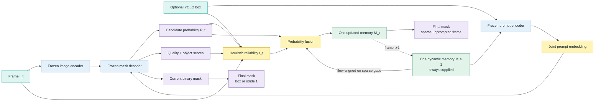

# Experiment

## Method

## Dynamic-memory equation

| Symbol | Definition |
|---|---|
| \(P_t\) | Current low-resolution mask probability |
| \(\tilde M_{t-1}\) | Previous memory; flow-aligned on sparse unprompted frames |
| \(r_t\) | Heuristic reliability in \([0,1]\) |
| \(M_t\) | Updated single dynamic probability memory |

\[
M_t = r_t P_t + (1-r_t)\tilde M_{t-1}
\]

## Reliability signals

| Signal | Source |
|---|---|
| Mask quality | MedSAM2 predicted IoU |
| Prompt confidence | YOLO confidence; neutral when absent |
| Boundary alignment | Image gradient at predicted boundary |
| Blur | Laplacian variance |
| Object presence | MedSAM2 object score |
| Penalties | Blank transition; implausible area; no evidence |

## Modules

| Component | Source | Training | State across frames |
|---|---|---:|---:|
| Image encoder | MedSAM2 | Frozen | No |
| Prompt encoder | MedSAM2 | Frozen | No |
| Mask decoder | MedSAM2 | Frozen | No |
| SAM2 memory bank | MedSAM2 | Disabled | No |
| Dynamic probability memory | Proposed | None | **One mask** |
| Reliability gate | Proposed | None | Scalar logs only |
| Optical-flow alignment | OpenCV Farneback | None | Previous frame only |

## Input and output policy

| Frame condition | Dynamic memory input | Box input | Saved mask |
|---|---:|---:|---|
| First frame; no prior memory | Neutral zero-logit mask | Optional | Current decoder mask |
| Stride 1 | Always | When detected | Current decoder mask |
| Sparse scheduled prompt frame | Always | When detected | Current decoder mask |
| Sparse unprompted frame | Always | No | Fused dynamic-memory mask |

## Evaluated schedules

| Result folder | Stride | Prompt limit | Sequences | Frames |
|---|---:|---:|---:|---:|
| `RELIABILITY_GATED_STRIDE1` | 1 | 0 | 23 | 2,225 |
| `RELIABILITY_GATED_STRIDE5` | 5 | 0 | 23 | 2,225 |
| `RELIABILITY_GATED_STRIDE10` | 10 | 0 | 23 | 2,225 |

## Recorded configuration

| Field | Value |
|---|---|
| Dataset | PolypGen test videos |
| Prompt source | YOLO |
| MedSAM2 checkpoint | `MedSAM2_latest.pt` |
| Configuration | `sam2.1_hiera_t512_no_memory.yaml` |
| Native memory | `num_maskmem = 0` |
| Memory prompt | Peak-normalized dense embedding |
| Sparse alignment | Farneback optical flow |
| Device | MPS |
| Trainable parameters | 0 |
| Missing predictions | 0 |

## Evaluation

| Level | Metrics |
|---|---|
| Frame | Dice; IoU; precision; recall; F2 |
| Sequence | Mean frame metrics |
| Global | Frame-macro mean over 2,225 frames |
| Temporal | Temporal IoU; centroid shift; area change |
| Diagnostics | Prompted/unprompted; positive/blank GT; reliability |

## Required paper controls

| Priority | Control |
|---:|---|
| 1 | Original MedSAM2/SAM2 stack; identical frames and YOLO prompts |
| 2 | No temporal memory |
| 3 | Single memory without reliability gating |
| 4 | Fixed EMA weights |
| 5 | Heuristic reliability |
| 6 | Learned calibration |
| 7 | Peak memory; latency; throughput |
| 8 | Sequence/patient bootstrap confidence intervals |
| 9 | External dataset |

## Visual report

[Architecture and results dashboard](architecture_diagram.html)
