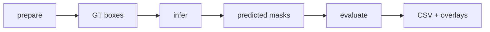

# Experiments

## Pipeline



## Data contract

| Path | Contents |
|---|---|
| `data/polypgen/seq*/images` | Frames |
| `data/polypgen/seq*/masks` | Ground truth |
| `data/bbox/seq*/bboxes.csv` | GT-derived boxes |
| `outputs/<method>/masks/seq*/predicted` | Predictions |
| `outputs/<method>/bbox` | YOLO boxes |
| `outputs/<method>/logs` | Sequence logs |
| `outputs/<method>/eval` | Metrics and overlays |

GT boxes are oracle prompts, not detector outputs.

## Commands

```bash
# Full enabled benchmark
bash scripts/run_polypgen_experiment.sh

# Preview
bash scripts/run_polypgen_experiment.sh --dry_run

# One stage
bash scripts/run_polypgen_experiment.sh --stage prepare
bash scripts/run_polypgen_experiment.sh --stage infer
bash scripts/run_polypgen_experiment.sh --stage eval

# Subset
bash scripts/run_polypgen_experiment.sh \
  --methods MedSAM2_YOLO_BOX_MASK_STRIDE5 \
  --seqs 1 2 3
```

## Method key

| Token | Meaning |
|---|---|
| `YOLO_BOX` | Detector prompt |
| `GT_BOX` | Oracle prompt |
| final `BOX` | Box enters video predictor |
| final `MASK` | Box becomes a mask prompt |
| `FRAME` | Independent frame inference |
| `STRIDE5` / `STRIDE10` | Prompt every 5 / 10 frames |
| `FIRST` | First valid prompt only |

## Methods

| Family | Prompt | Schedule | Variants |
|---|---|---|---:|
| YOLO + SAM2 | YOLO or GT box | Every frame | 2 |
| SAM2 Large | GT box | Every frame | 1 |
| MedSAM2 | YOLO or GT; box or mask | Every frame | 4 |
| MedSAM2 | YOLO or GT; box or mask | Stride 5 | 4 |
| MedSAM2 | YOLO or GT; box or mask | Stride 10 | 4 |
| MedSAM2 | YOLO or GT; box or mask | First only | 4 |
| MedSAM3 | Text `polyp` | Per config | 1, disabled |

The 19 enabled methods are defined in `experiments/polypgen_medsam2_yolo_sam2.json`.

## Configuration

| Field | Values |
|---|---|
| `runner` | `YOLO_SAM2`, `MedSAM2`, `MedSAM3` |
| `prompt_source` | `yolo`, `gt_bbox` |
| `video_prompt_source` | `box`, `mask` |
| `video_prompt_stride` | `1`, `5`, `10` |
| `video_prompt_limit` | `0` unlimited, `1` first only |
| `eval_type` | `mask`, `bbox`, `both` |
| `enabled` | Run by default |

Prefer config changes over edits in `external/`.

## Evaluation

| Level | Output |
|---|---|
| Frame | `seq*/metrics.csv` |
| Sequence | `metrics_per_sequence.csv` |
| Global | `metrics_avg.csv`, `metrics_stats.csv` |
| Visual | `seq*/overlays/*_mask_overlay.png` |

| Group | Metrics |
|---|---|
| Spatial | Dice, IoU, F-measure, sensitivity, specificity |
| Structural | S-measure, E-measure |
| Temporal | Adjacent IoU, area change, centroid shift |
| Detector | Bbox IoU; missed detections score `0` |

## Reliability-gated run

This entrypoint uses `data/test/polypgen` and `data/test/bbox`.

```bash
DRIVE_ADESEG="$HOME/Library/CloudStorage/GoogleDrive-phammaianh11102005@gmail.com/My Drive/AdeSEG"

for STRIDE in 1 5 10; do
  .venv/bin/python experiments/reliability_gated_memory_experiment.py \
    --output-root "$DRIVE_ADESEG/outputs/reliability_gated_stride${STRIDE}" \
    --require-google-drive-output \
    --sequences 1-23 \
    --prompt-source gt_bbox \
    --video-prompt-stride "$STRIDE" \
    --video-prompt-limit 0 \
    --candidate-device cpu \
    --no-generate-bboxes
done
```

## Failure checks

| Symptom | Check |
|---|---|
| Unknown method | JSON method name |
| Missing GT boxes | Run `--stage prepare` |
| Missing masks | `<method>/logs/seq*.json` |
| Blank masks | Prompt count and traceback |
| Missing bbox metrics | Only YOLO methods write detections |
| Import/checkpoint error | Environment and config paths |

```bash
python3 scripts/utils/failure_analysis.py disconnect \
  --methods MedSAM2_YOLO_BOX_MASK YOLO_SAM2_YOLO_BOX_FRAME \
  --output_dir outputs/failure_analysis
```
