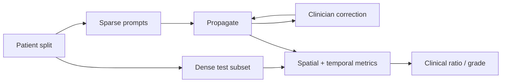

# Adenoid Study Protocol

## Goal

Stable video masks with low clinician correction burden.

| Label | Definition |
|---|---|
| `adenoid` | Visible adenoid tissue |
| `nasopharynx_airway` | Open airway or ENT-defined reference cavity |

Keep the labels separate.

## Dataset

```text
data/adenoid/
  patient_<id>/
    video_<id>/
      images/
      masks/
        adenoid/
        nasopharynx_airway/
      metadata.json
```

| Rule | Requirement |
|---|---|
| Split | Patient-level |
| Sparse labels | Keyframes and corrections |
| Dense labels | Representative video subset |
| Double annotation | ENT subset |
| Hard cases | Reserved review set |

Suggested pilot: 30–50 videos.

## Metadata

| Field | Example |
|---|---|
| Identity | Patient, session, video |
| Acquisition | FPS, scope, site |
| Clinical | Grade, obstruction score |
| Annotation | Annotator, adjudication |
| Quality | Blur, mucus, occlusion, exposure |

## Annotation decisions

| Topic | Decision needed |
|---|---|
| Adenoid edge | Visible or inferred boundary |
| Airway | Lumen, choana, or full cavity |
| Partial view | Visible-only, weak label, or exclude |
| Artifacts | Mucus, glare, tools, blood, blur |
| Disagreement | ENT adjudication rule |

## Study design



| Experiment | Prompt burden |
|---|---|
| GT box every frame | Oracle upper bound |
| Detector box every frame | Fully automatic baseline |
| Prompt every 5 frames | Medium |
| Prompt every 10 frames | Low |
| First valid prompt | Minimum |
| Prompt on drift | Adaptive correction |

## Metrics

| Group | Metrics |
|---|---|
| Segmentation | Dice, IoU, boundary error |
| Temporal | Adjacent IoU, area change, centroid shift |
| Effort | Prompts/video, prompts/100 frames, correction time |
| Clinical | Ratio error, grade agreement, Cohen's kappa |
| Reliability | Failure count, duration, recovery |
| Annotation | Inter-rater Dice, boundary and ratio disagreement |

Choose one primary ratio before analysis:

| Candidate | Formula |
|---|---|
| Tissue/airway | `adenoid_area / airway_area` |
| Tissue/total | `adenoid_area / (adenoid_area + airway_area)` |
| Obstruction | `1 - airway_area / reference_area` |

## Reporting

| Report separately | Reason |
|---|---|
| Each label | Different difficulty |
| Each patient | Avoid frame dominance |
| Positive / empty frames | Expose false persistence |
| Prompt frequency | Show effort–accuracy tradeoff |
| Easy / hard videos | Show failure modes |

## Scope boundary

PolypGen validates the engineering pipeline only. Clinical claims require adenoid data, ENT labels, patient splits, and clinical outcomes.
