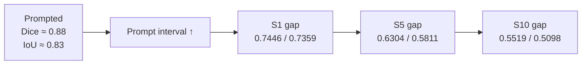

# Results

## Evidence

| Folder | Sequences | Frames | Missing | Prompt source | Memory |
|---|---:|---:|---:|---|---|
| `RELIABILITY_GATED_STRIDE1` | 23 | 2,225 | 0 | YOLO | Single dynamic mask |
| `RELIABILITY_GATED_STRIDE5` | 23 | 2,225 | 0 | YOLO | Single dynamic mask |
| `RELIABILITY_GATED_STRIDE10` | 23 | 2,225 | 0 | YOLO | Single dynamic mask |

## Global Dice and IoU

| Schedule | Prompts | Prompt rate | Dice ↑ | IoU ↑ | Δ Dice vs S1 | Δ IoU vs S1 |
|---|---:|---:|---:|---:|---:|---:|
| Stride 1 | 1,539 | 69.2% | **0.8442** | **0.8026** | — | — |
| Stride 5 | 322 | 14.5% | 0.6677 | 0.6174 | −0.1765 | −0.1852 |
| Stride 10 | 167 | 7.5% | 0.5765 | 0.5335 | −0.2676 | −0.2691 |
| YOLO-SAM2 supplied-image reference | — | — | 0.8080 | 0.6780 | protocol unknown | protocol unknown |

```mermaid
xychart-beta
    title "Global overlap"
    x-axis ["YOLO-SAM2*", "Stride 1", "Stride 5", "Stride 10"]
    y-axis "Score" 0 --> 1
    bar [0.8080, 0.8442, 0.6677, 0.5765]
    bar [0.6780, 0.8026, 0.6174, 0.5335]
```

## Prompted vs unprompted frames

| Schedule | Prompted Dice | Prompted IoU | Unprompted Dice | Unprompted IoU | Gap: Dice | Gap: IoU |
|---|---:|---:|---:|---:|---:|---:|
| Stride 1 | **0.8885** | **0.8323** | **0.7446** | **0.7359** | −0.1439 | −0.0964 |
| Stride 5 | 0.8876 | 0.8319 | 0.6304 | 0.5811 | −0.2571 | −0.2508 |
| Stride 10 | 0.8799 | 0.8254 | 0.5519 | 0.5098 | −0.3281 | −0.3156 |

## Frame-level distribution

| Schedule | Dice = 0 | Dice ≥ 0.50 | Dice ≥ 0.70 | Dice ≥ 0.90 | Positive-GT Dice | Blank-GT Dice |
|---|---:|---:|---:|---:|---:|---:|
| Stride 1 | 8.0% | 89.0% | **86.8%** | **74.3%** | **0.8229** | **0.9146** |
| Stride 5 | 19.1% | 71.7% | 66.6% | 48.7% | 0.6483 | 0.7320 |
| Stride 10 | 29.2% | 61.6% | 56.8% | 41.6% | 0.5022 | 0.8233 |

## Per-sequence distribution

| Schedule | Q1 Dice | Median Dice | Q3 Dice | Dice ≥ 0.70 | IoU ≥ 0.70 | Minimum Dice |
|---|---:|---:|---:|---:|---:|---:|
| Stride 1 | 0.7769 | **0.9136** | 0.9350 | 18 / 23 | 18 / 23 | 0.2030 |
| Stride 5 | 0.5667 | 0.6918 | 0.7861 | 11 / 23 | 9 / 23 | 0.3457 |
| Stride 10 | 0.4331 | 0.5935 | 0.7534 | 10 / 23 | 6 / 23 | 0.2766 |

## Per-sequence Dice and IoU

| Seq | Frames | S1 Dice | S1 IoU | S5 Dice | S5 IoU | S10 Dice | S10 IoU |
|---|---:|---:|---:|---:|---:|---:|---:|
| 1† | 36 | 1.0000 | 1.0000 | 1.0000 | 1.0000 | 1.0000 | 1.0000 |
| 2 | 63 | 0.9014 | 0.8458 | 0.8303 | 0.7685 | 0.8183 | 0.7481 |
| 3 | 15 | 0.2030 | 0.1478 | 0.8078 | 0.7278 | 0.8078 | 0.7278 |
| 4 | 48 | 0.3863 | 0.3483 | 0.3638 | 0.3339 | 0.2995 | 0.2719 |
| 5 | 250 | 0.9380 | 0.8977 | 0.6738 | 0.6293 | 0.5468 | 0.5133 |
| 6 | 91 | 0.9233 | 0.8888 | 0.7747 | 0.7268 | 0.7236 | 0.6837 |
| 7† | 48 | 1.0000 | 1.0000 | 1.0000 | 1.0000 | 1.0000 | 1.0000 |
| 8 | 73 | 0.9136 | 0.8763 | 0.6018 | 0.5433 | 0.5360 | 0.4849 |
| 9 | 51 | 0.5512 | 0.5003 | 0.5317 | 0.4754 | 0.5291 | 0.4721 |
| 10 | 25 | 0.9522 | 0.9449 | 0.7792 | 0.7663 | 0.8414 | 0.8137 |
| 11 | 228 | 0.8600 | 0.8164 | 0.8076 | 0.7460 | 0.7471 | 0.6873 |
| 12 | 250 | 0.9336 | 0.8859 | 0.7514 | 0.6808 | 0.4629 | 0.4108 |
| 13 | 250 | 0.8197 | 0.7884 | 0.6380 | 0.6014 | 0.5935 | 0.5539 |
| 14 | 249 | 0.8046 | 0.7530 | 0.5296 | 0.4723 | 0.4033 | 0.3630 |
| 15 | 116 | 0.7723 | 0.7262 | 0.7008 | 0.6565 | 0.7018 | 0.6582 |
| 16 | 40 | 0.9318 | 0.9149 | 0.7467 | 0.7246 | 0.7477 | 0.7249 |
| 17 | 63 | 0.9365 | 0.9077 | 0.6554 | 0.6055 | 0.5810 | 0.5365 |
| 18 | 63 | 0.5835 | 0.4612 | 0.4031 | 0.2935 | 0.2766 | 0.2055 |
| 19 | 56 | 0.9419 | 0.8962 | 0.7930 | 0.7291 | 0.7590 | 0.6967 |
| 20 | 52 | 0.5738 | 0.5570 | 0.3588 | 0.3386 | 0.2885 | 0.2885 |
| 21 | 56 | 0.9326 | 0.9016 | 0.6918 | 0.6538 | 0.6466 | 0.6049 |
| 22 | 46 | 0.9298 | 0.8868 | 0.6050 | 0.5481 | 0.3803 | 0.3237 |
| 23 | 56 | 0.7816 | 0.7386 | 0.3457 | 0.3136 | 0.3500 | 0.3292 |

† No positive-GT frames.

## Largest schedule effects

| Comparison | Best / worst | Sequence | Δ Dice | Δ IoU |
|---|---|---|---:|---:|
| S5 − S1 | Best | seq3 | +0.6048 | +0.5799 |
| S5 − S1 | Worst | seq23 | −0.4359 | −0.4250 |
| S10 − S5 | Best | seq10 | +0.0622 | +0.0473 |
| S10 − S5 | Worst | seq12 | −0.2886 | −0.2700 |
| S10 − S1 | Worst | seq22 | −0.5494 | −0.5630 |

## Evidence matrix

| Claim | Status | Evidence | Missing |
|---|---|---|---|
| Constant-capacity external memory | Supported | Single dynamic mask; `num_maskmem=0` | Peak-memory benchmark |
| Strong stride-1 overlap | Supported | Dice 0.8442; IoU 0.8026 | Matched original-stack run |
| Stride-5 Dice near 0.70 | Partial | Dice 0.6677; IoU 0.6174 | Confidence intervals; external dataset |
| Stride-10 robustness | Not supported | Dice 0.5765; IoU 0.5335 | Stronger sparse propagation |
| Reliability is necessary | Not tested | Heuristic only | Fixed EMA; no gate; calibrated gate |
| Better than SAM2 stack | Not tested | No matched result | Same evaluator and prompt schedule |
| First-prompt-only result | Absent | No folder | 23-sequence run |

## Visual report

[Architecture and results dashboard](architecture_diagram.html)
