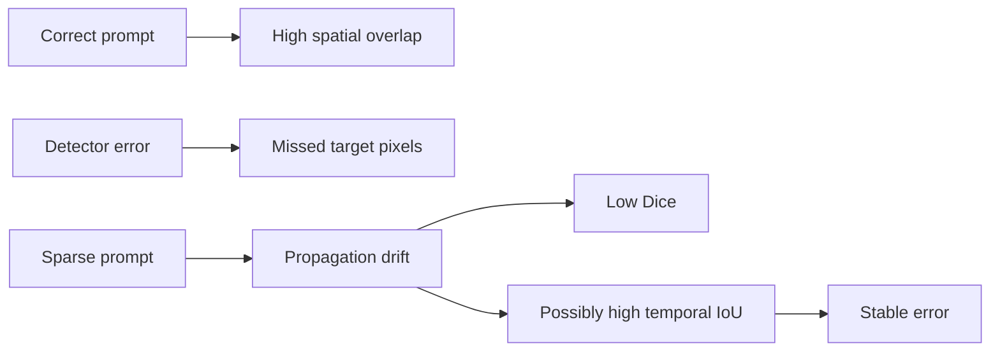

# Results

## 1. Scope and sources

| Item | Value |
|---|---|
| Dataset | PolypGen proxy benchmark |
| Sequences | 23 |
| Main methods | 20 |
| Main aggregation | Mean of 23 sequence-level means |
| Gated aggregation | Mean over 2,225 frames |
| Project | [Drive](https://drive.google.com/drive/folders/1NMiVWai1_8xgT5qZ6Hb8v52xPYA_f48d) |
| Logs | [Drive](https://drive.google.com/drive/folders/1-oTZ4h7_47qXIjZOw6e0C3itfvgU8cnr) |
| Outputs | [Drive](https://drive.google.com/drive/folders/11q_daWX4jO5XbvZ-PY9KWbIkx3XM7O2o) |

The main tables use the full Drive metric exports. `seq1` and `seq7` are all-empty sequences. Empty prediction against empty ground truth scores `1.0` for Dice, IoU, sensitivity, and temporal IoU; positive-frame reporting is therefore also required.

> PolypGen measures pipeline behavior. It does not validate adenoid segmentation clinically.

## 2. Metric guide

### Spatial metrics

| Metric | Direction | Measures | Endoscopy warning |
|---|---:|---|---|
| Dice / F1 | ↑ | Foreground overlap | Small boundary errors strongly affect small objects |
| IoU | ↑ | Stricter foreground overlap | Best primary overlap metric with Dice |
| Sensitivity | ↑ | Fraction of target pixels recovered | Can be high with severe over-segmentation |
| Specificity | ↑ | Fraction of background pixels rejected | Often inflated by large background regions |
| S-measure | ↑ | Object and regional structure | Useful for gross shape, not a boundary metric |
| E-measure | ↑ | Local and global alignment | Can remain high when foreground overlap is moderate |
| Predicted area | Match GT | Foreground fraction | Exposes under- and over-segmentation |

`F-measure` uses `β=1`, so it is numerically equal to Dice for these binary masks. It is retained for compatibility but is not independent evidence.

### Temporal metrics

| Metric | Direction | Measures | Endoscopy warning |
|---|---:|---|---|
| Temporal IoU | ↑ | Overlap of adjacent predictions | Frozen or empty masks can score highly |
| Area change | ↓ | Absolute foreground-area change | Real camera/object motion can cause valid change |
| Centroid shift | ↓ | Motion of mask center, normalized by image diagonal | Low shift may mean stable error |
| Missing predictions | ↓ | Output completeness | Missing frames must count as failures |

Temporal metrics describe smoothness, not correctness. Interpret them only beside Dice/IoU and the ground-truth motion pattern.

## 3. Main spatial results

Sequence-macro averages. Higher is better.

| Rank | Method | Dice / F1 | IoU | Sensitivity | Specificity | S-measure | E-measure |
|---:|---|---:|---:|---:|---:|---:|---:|
| 1 | `SAM2_LARGE_GT_BOX_FRAME` | **0.9457** | **0.9071** | 0.9446 | 0.9949 | **0.9471** | **0.9818** |
| 2 | `YOLO_SAM2_GT_BOX_FRAME` | 0.9415 | 0.9027 | 0.9444 | 0.9922 | 0.9439 | 0.9808 |
| 3 | `YOLO_SAM2_YOLO_BOX_FRAME` | 0.7851 | 0.7511 | 0.7860 | 0.9873 | 0.8675 | 0.8648 |
| 4 | `MedSAM2_GT_BOX_MASK` | 0.7436 | 0.7069 | 0.9050 | 0.9694 | 0.9037 | 0.9320 |
| 5 | `MedSAM3_TEXT_POLYP` | 0.6663 | 0.6275 | 0.9216 | 0.9524 | 0.8959 | 0.9284 |
| 6 | `MedSAM2_YOLO_BOX_MASK` | 0.6219 | 0.5823 | 0.7746 | 0.9492 | 0.8206 | 0.8473 |
| 7 | `MedSAM2_GT_BOX_BOX` | 0.5629 | 0.4777 | 0.7079 | 0.9592 | 0.7652 | 0.8396 |
| 8 | `MedSAM2_YOLO_BOX_BOX` | 0.5135 | 0.4296 | 0.6589 | 0.9483 | 0.7370 | 0.8239 |
| 9 | `MedSAM2_GT_BOX_MASK_STRIDE5` | 0.4500 | 0.3978 | 0.6170 | 0.9464 | 0.7146 | 0.7961 |
| 10 | `MedSAM2_YOLO_BOX_MASK_STRIDE5` | 0.4260 | 0.3732 | 0.5845 | 0.9475 | 0.7011 | 0.7627 |
| 11 | `MedSAM2_GT_BOX_MASK_STRIDE10` | 0.4247 | 0.3721 | 0.5523 | 0.9622 | 0.6935 | 0.7786 |
| 12 | `MedSAM2_YOLO_BOX_MASK_STRIDE10` | 0.4175 | 0.3662 | 0.5320 | 0.9640 | 0.6874 | 0.7472 |
| 13 | `MedSAM2_GT_BOX_BOX_STRIDE5` | 0.4083 | 0.3442 | 0.5741 | 0.9429 | 0.6829 | 0.7793 |
| 14 | `MedSAM2_GT_BOX_BOX_STRIDE10` | 0.4022 | 0.3440 | 0.5341 | 0.9603 | 0.6784 | 0.7775 |
| 15 | `MedSAM2_YOLO_BOX_BOX_STRIDE10` | 0.3971 | 0.3418 | 0.5142 | 0.9637 | 0.6747 | 0.7399 |
| 16 | `MedSAM2_YOLO_BOX_BOX_STRIDE5` | 0.3858 | 0.3237 | 0.5489 | 0.9421 | 0.6739 | 0.7469 |
| 17 | `MedSAM2_GT_BOX_BOX_FIRST` | 0.3467 | 0.2985 | 0.4929 | 0.9523 | 0.6513 | 0.7375 |
| 18 | `MedSAM2_GT_BOX_MASK_FIRST` | 0.3412 | 0.2941 | 0.4966 | 0.9457 | 0.6494 | 0.7339 |
| 19 | `MedSAM2_YOLO_BOX_BOX_FIRST` | 0.3285 | 0.2827 | 0.4821 | 0.9397 | 0.6390 | 0.7247 |
| 20 | `MedSAM2_YOLO_BOX_MASK_FIRST` | 0.3243 | 0.2791 | 0.4902 | 0.9333 | 0.6364 | 0.7104 |

### Spatial interpretation

| Finding | Evidence | Meaning |
|---|---|---|
| Frame SAM2 is strongest | Dice `0.9457–0.9415` with GT boxes | Segmentation is accurate when the prompt is correct |
| Detector error is important | GT box → YOLO box Dice: `0.9415 → 0.7851` | Prompt localization is a major automatic-pipeline bottleneck |
| Specificity hides failures | First-only methods keep specificity `0.9333–0.9523` with Dice `0.3243–0.3467` | Background dominance makes specificity unsuitable as a primary ranker |
| Mask prompts help MedSAM2 | GT mask vs GT box Dice: `0.7436 vs 0.5629` | Box-to-mask conversion gives a stronger video seed |
| MedSAM3 favors recall | Sensitivity `0.9216`, Dice `0.6663`, specificity `0.9524` | It often finds target pixels but includes excess foreground |
| Sparse prompts lose overlap | GT-mask Dice: `0.7436 → 0.4500 → 0.4247` | Propagation drifts as prompt distance grows |

The automatic frame method loses `0.1564` Dice but only `0.0049` specificity relative to the same SAM2 model with GT boxes. This is the clearest example of why specificity alone can miss clinically visible segmentation failure.

## 4. Main temporal and mask-behavior results

Sequence-macro averages. Predicted area is an image fraction. Centroid shift is normalized by image diagonal.

| Method | Pred. area | Temporal IoU ↑ | Area change ↓ | Centroid shift ↓ |
|---|---:|---:|---:|---:|
| `SAM2_LARGE_GT_BOX_FRAME` | 0.0831 | 0.6465 | 0.0304 | 0.0516 |
| `YOLO_SAM2_GT_BOX_FRAME` | 0.0858 | 0.6499 | 0.0304 | **0.0497** |
| `YOLO_SAM2_YOLO_BOX_FRAME` | 0.0763 | **0.6698** | 0.0407 | 0.0626 |
| `MedSAM2_GT_BOX_MASK` | 0.1061 | 0.5998 | 0.0316 | 0.0621 |
| `MedSAM3_TEXT_POLYP` | 0.1247 | 0.5044 | 0.0601 | 0.0963 |
| `MedSAM2_YOLO_BOX_MASK` | 0.1139 | 0.6123 | 0.0385 | 0.0656 |
| `MedSAM2_GT_BOX_BOX` | 0.0889 | 0.4777 | 0.0383 | 0.0773 |
| `MedSAM2_YOLO_BOX_BOX` | 0.0936 | 0.4536 | 0.0458 | 0.0891 |
| `MedSAM2_GT_BOX_MASK_STRIDE5` | 0.0977 | 0.4813 | 0.0398 | 0.0947 |
| `MedSAM2_YOLO_BOX_MASK_STRIDE5` | 0.0926 | 0.5341 | 0.0371 | 0.0785 |
| `MedSAM2_GT_BOX_MASK_STRIDE10` | 0.0712 | 0.5204 | 0.0308 | 0.0795 |
| `MedSAM2_YOLO_BOX_MASK_STRIDE10` | 0.0672 | 0.5816 | 0.0299 | 0.0659 |
| `MedSAM2_GT_BOX_BOX_STRIDE5` | 0.0937 | 0.4622 | 0.0400 | 0.0977 |
| `MedSAM2_GT_BOX_BOX_STRIDE10` | 0.0705 | 0.5048 | 0.0327 | 0.0826 |
| `MedSAM2_YOLO_BOX_BOX_STRIDE10` | 0.0653 | 0.5680 | 0.0313 | 0.0680 |
| `MedSAM2_YOLO_BOX_BOX_STRIDE5` | 0.0919 | 0.5047 | 0.0390 | 0.0808 |
| `MedSAM2_GT_BOX_BOX_FIRST` | 0.0750 | 0.6098 | 0.0275 | 0.0570 |
| `MedSAM2_GT_BOX_MASK_FIRST` | 0.0831 | 0.6284 | **0.0271** | 0.0623 |
| `MedSAM2_YOLO_BOX_BOX_FIRST` | 0.0859 | 0.6036 | 0.0323 | 0.0552 |
| `MedSAM2_YOLO_BOX_MASK_FIRST` | 0.0927 | 0.6301 | 0.0281 | 0.0614 |

### Temporal interpretation

| Observation | Interpretation |
|---|---|
| Automatic frame SAM2 has temporal IoU `0.6698` and Dice `0.7851` | Good overall automatic baseline |
| First-only MedSAM2 reaches temporal IoU `0.6036–0.6301` but Dice `0.3243–0.3467` | Smooth propagation can be spatially wrong |
| MedSAM3 has high sensitivity but temporal IoU `0.5044` and area change `0.0601` | Broad detection with unstable masks |
| Low area change in first-only variants accompanies poor Dice | A nearly frozen mask is not a successful tracker |
| Temporal IoU can rise as prompt frequency falls | Persistence must not be interpreted as accuracy |

## 5. Prompt strategy analysis

| Comparison | Dice | Sensitivity | Specificity | Temporal IoU |
|---|---:|---:|---:|---:|
| SAM2, GT box, frame | **0.9415** | **0.9444** | **0.9922** | 0.6499 |
| SAM2, YOLO box, frame | 0.7851 | 0.7860 | 0.9873 | **0.6698** |
| MedSAM2, GT mask, every frame | 0.7436 | 0.9050 | 0.9694 | 0.5998 |
| MedSAM2, GT mask, stride 5 | 0.4500 | 0.6170 | 0.9464 | 0.4813 |
| MedSAM2, GT mask, stride 10 | 0.4247 | 0.5523 | 0.9622 | 0.5204 |
| MedSAM2, GT mask, first only | 0.3412 | 0.4966 | 0.9457 | 0.6284 |

## 6. Reliability-gated experiment

`scripts/utils/reliability_gate.py` was rewritten after the results above were produced. It no
longer runs a discrete accept/hold gate with a threshold and rejection counter; see
[Technical §Reliability gate](TECHNICAL.md#reliability-gate) for the current mechanism. In
short: MedSAM2 runs with its internal memory bank disabled (`num_maskmem=0`), so the raw
`candidate` mask is an independent per-frame prediction with no memory of its own, and the gate
is the only cross-frame state left — a continuous reliability-weighted blend
`M_t = R_t·candidate_t + (1-R_t)·M_(t-1)`, with `R` built from decoder confidence, prompt
confidence, boundary alignment, and sharpness (no temporal-IoU or area term). The numbers below
are from that current implementation, GT-derived box prompts, CPU inference, all 23 sequences
(2,225 frames), frame-macro aggregation. The gated evaluator records Dice, IoU, temporal IoU,
centroid shift, area change, and reliability; it does not record sensitivity or specificity.

| Metric | Stride 1 | Stride 5 | Stride 10 |
|---|---:|---:|---:|
| Frames | 2,225 | 2,225 | 2,225 |
| Missing predictions | 0 | 0 | 0 |
| Boxed (prompted) frames | **1,710** | 352 | 177 |
| Candidate Dice | **0.9287** | 0.3750 | 0.3044 |
| Candidate IoU | **0.8859** | 0.3664 | 0.3000 |
| Candidate temporal IoU | 0.6405 | 0.6898 | **0.8447** |
| Gated Dice | **0.7863** | 0.6232 | 0.5642 |
| Gated IoU | **0.7434** | 0.5562 | 0.4949 |
| Gated temporal IoU | 0.6907 | 0.9003 | **0.9375** |
| Gated centroid shift, px | 78.31 | 26.27 | **16.02** |
| Gated area change | 0.01928 | 0.00695 | **0.00400** |
| Mean reliability (blend weight) | **0.7211** | 0.2023 | 0.1442 |
| Total time | 9m 18s | 6m 17s | **5m 41s** |

Candidate centroid shift is `NaN`/pixels in most sequences at stride 5 and 10 (too many
consecutive empty candidates to define a shift) and is omitted above; gated centroid shift is
pixels, not directly comparable with the normalized centroid values in the main benchmark table.

### Gate effect: candidate vs. gated, by stride

| Stride | Candidate Dice | Gated Dice | Δ Dice | Candidate temporal IoU | Gated temporal IoU | Δ temporal |
|---:|---:|---:|---:|---:|---:|---:|
| 1 | 0.9287 | 0.7863 | **-0.1425** | 0.6405 | 0.6907 | +0.0502 |
| 5 | 0.3750 | 0.6232 | **+0.2482** | 0.6898 | 0.9003 | +0.2104 |
| 10 | 0.3044 | 0.5642 | **+0.2598** | 0.8447 | 0.9375 | +0.0928 |

The effect flips with prompt density. At stride 1, almost every frame has a fresh GT box
(1,710/2,225), so the raw per-frame candidate is already strong (Dice `0.9287`); blending in the
soft memory only pulls it down. At stride 5 and 10, most frames have no candidate at all — a
per-frame prediction with the memory bank disabled produces nothing without a fresh box, so the
un-blended candidate Dice collapses to `0.30–0.38`. There, the reliability blend is what carries
a plausible mask across the un-prompted gap, recovering roughly `0.25–0.26` Dice and `0.09–0.21`
temporal IoU over the raw candidate. Mean reliability drops sharply as stride grows (`0.72 →
0.20 → 0.14`): most frames get the neutral `r_prompt = 0.5` and a low-confidence, likely-empty
candidate, so the blend leans on the previous memory mask rather than the new one — which is the
intended behavior for un-prompted gaps.

At the current implementation, the gate is a compensation mechanism for missing per-frame
prompts, not an unconditional accuracy improvement: it helps substantially under sparse
prompting (stride 5, 10) and actively hurts when prompts are already dense (stride 1). Treat it
as a stride-dependent trade rather than a strict win or loss.

## 7. Endoscopy-video evaluation framework

Endoscopy contains camera motion, blur, glare, mucus, temporary disappearance, deformation, and large background regions. A useful evaluation must answer five different questions.

| Question | Required metrics | Failure exposed |
|---|---|---|
| Is the visible target segmented correctly? | Positive-frame Dice, IoU, boundary score | Poor overlap or boundary |
| Is target tissue missed? | Sensitivity, false-negative area | Under-segmentation |
| Does foreground persist after disappearance? | Empty-frame false-positive rate, specificity, predicted area | Ghost masks |
| Is tracking temporally plausible? | Temporal IoU, area change, centroid shift, failure duration | Flicker, jumps, freeze |
| Is the workflow practical? | Prompts/video, correction count, runtime | Excess clinician effort |

### Recommended reporting units

| Level | Primary report | Why |
|---|---|---|
| Frame | Positive, empty, transition, degraded-quality subsets | Separates clinical situations |
| Sequence | Mean, median, worst sequence, failure duration | Prevents easy frames hiding collapse |
| Patient | Patient-macro mean with confidence interval | Correct clinical unit |
| Acquisition site/device | Stratified scores | Detects domain shift |
| Prompt strategy | Accuracy vs prompts and corrections | Measures usable efficiency |

### Required frame subsets

| Subset | Report |
|---|---|
| Target visible | Dice, IoU, sensitivity, boundary error |
| Target absent | Correct-empty rate, false-positive area, specificity |
| Entry/exit transition | Disappearance and recovery delay |
| Blur/glare/mucus | Accuracy drop and recovery time |
| Fast camera motion | Centroid and overlap change relative to GT |
| Partial visibility | Visible-only overlap and failure flags |

### Model-selection order

1. Verify one prediction per input frame.
2. Rank positive-frame Dice/IoU at patient or sequence level.
3. Reject persistent false positives on empty frames.
4. Compare sensitivity and predicted area to distinguish misses from over-segmentation.
5. Use temporal metrics only among models with comparable spatial accuracy.
6. Compare prompt burden, correction burden, and runtime.
7. Validate downstream clinical measurements separately.

## 8. What the current metrics imply

| Model behavior | Metric pattern | Interpretation |
|---|---|---|
| Accurate segmentation | High Dice/IoU, balanced sensitivity/specificity | Preferred |
| Over-segmentation | High sensitivity, lower Dice/specificity, large predicted area | Includes non-target tissue |
| Under-segmentation | High specificity, low sensitivity/Dice, small predicted area | Misses target tissue |
| Flicker | Moderate Dice, low temporal IoU, high area/centroid change | Unstable video output |
| Frozen drift | Low Dice, high temporal IoU, low area/centroid change | Stable but wrong |
| Disappearance failure | Good positive Dice, poor empty-frame correctness | Mask persists after target leaves |

Current examples:

| Example | Pattern |
|---|---|
| `SAM2_LARGE_GT_BOX_FRAME` | Best spatial upper bound; balanced sensitivity and specificity |
| `YOLO_SAM2_YOLO_BOX_FRAME` | Best fully automatic benchmark; detector gap remains |
| `MedSAM3_TEXT_POLYP` | High sensitivity with larger masks and lower temporal stability |
| First-only MedSAM2 | High apparent smoothness with severe spatial drift |
| Reliability gate, stride 1 | Higher temporal IoU but lower Dice than the dense-prompt candidate |
| Reliability gate, stride 5/10 | Higher Dice *and* higher temporal IoU than the sparse-prompt candidate — compensates for missing per-frame candidates |

## 9. Recommended next metrics

| Add | Purpose |
|---|---|
| Precision / false-positive rate | Complete sensitivity-specificity interpretation |
| Boundary F-score or HD95 | Assess anatomical boundary accuracy |
| GT-normalized temporal error | Separate real motion from prediction instability |
| Failure episode count/duration | Measure sustained tracking collapse |
| Recovery latency | Measure recovery after occlusion or blur |
| Prompt/correction burden | Measure clinician effort |
| Adenoid-to-airway ratio error | Measure downstream clinical impact |
| Grade agreement and Cohen's kappa | Measure clinical decision agreement |
| Patient bootstrap confidence intervals | Quantify uncertainty |

## 10. Decision summary

| Goal | Current choice | Reason |
|---|---|---|
| Segmentation upper bound | SAM2 Large + GT box, frame | Dice `0.9457`, IoU `0.9071` |
| Fully automatic proxy baseline | SAM2 + YOLO box, frame | Dice `0.7851`, best automatic overlap |
| Detector-free text baseline | MedSAM3 | Sensitivity `0.9216`, but lower overlap and stability |
| Best MedSAM2 prompt type | Mask prompt | Better Dice than direct box prompt |
| Sparse-prompt deployment | Not ready | Large Dice loss and drift |
| Current reliability gate | Use only under sparse prompting | Recovers Dice `+0.25–0.26` and temporal IoU `+0.09–0.21` at stride 5/10; costs Dice `-0.14` at stride 1 |

No single score is sufficient for endoscopy video. Use spatial correctness first, empty-frame safety second, temporal behavior third, and workflow/clinical impact last.
