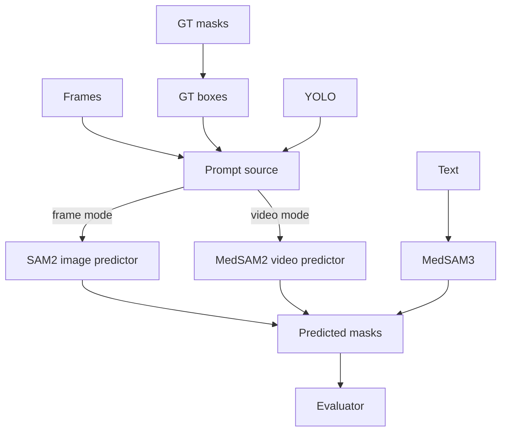
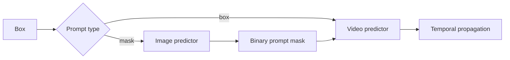

# Technical Reference

## Architecture



## Components

| File | Responsibility |
|---|---|
| `scripts/experiments/run_experiment.py` | Prepare, infer, evaluate |
| `scripts/utils/ground_truth_bbox_gen.py` | Mask → oracle box |
| `scripts/utils/eval_metrics.py` | Spatial and temporal metrics |
| `scripts/utils/failure_analysis.py` | Disconnects and timelines |
| `experiments/reliability_gated_memory_experiment.py` | Candidate, gate, report |
| `scripts/utils/reliability_gate.py` | Reliability scoring and soft-memory blend |
| `scripts/utils/mask_utils.py` | Binary mask I/O |
| `scripts/utils/data_quality.py` | Frame/video quality audit (BRISQUE/NIQE/MUSIQ via `external/IQA-PyTorch` when importable) |
| `scripts/utils/ground_truth_temporal_iou_window.py` | Ground-truth-only temporal IoU over a bounded lookback window |
| `scripts/utils/extract_gt_temporal_iou_per_frame.py` | Per-frame summaries from the ground-truth all-pairs temporal IoU CSV |
| `scripts/utils/create_drive_method_sequence_scores.py` | Pulls per-method sequence score CSVs from the Drive metric exports |
| `scripts/utils/eval.py` | Shared bbox/mask evaluation runner used by ad hoc scripts |
| `external/` | Model implementations |

## Two entrypoints

| Item | Main benchmark | Reliability gate |
|---|---|---|
| Config | JSON | Python constants + CLI |
| Data | `data/polypgen` | `data/test/polypgen` |
| Boxes | `data/bbox` | `data/test/bbox` |
| Output | `outputs/<method>` | One isolated run root |
| Baseline | Multiple methods | Gated-only |

## MedSAM2 prompt flow



| Setting | Behavior |
|---|---|
| `stride=1` | Eligible every frame |
| `stride=5` | Indices 0, 5, 10, ... |
| `stride=10` | Indices 0, 10, 20, ... |
| `limit=1` | First successful prompt |
| `limit=0` | Unlimited |

An eligible frame without a box is skipped; the prompt is not shifted.

## Reliability gate

The reliability-gated entrypoint runs MedSAM2 with its internal memory bank disabled
(`sam2.1_hiera_t512_no_memory.yaml`, `num_maskmem=0`), so every frame's SAM2 output is an
independent per-frame candidate with no cross-frame state of its own. The gate supplies the
*only* cross-frame memory in this pipeline: a per-frame reliability score blends each
candidate into a running soft memory mask. There is no accept/reject decision, no threshold,
and no rejection counter — every frame updates memory, by an amount set by that frame's score.

| Signal | Weight | Definition |
|---|---:|---|
| Confidence (`r_conf`) | 0.35 | SAM2's own decoder object-score confidence (sigmoid of the object-score logit); `0.5` when unavailable |
| Prompt confidence (`r_prompt`) | 0.25 | Confidence of the box that seeded this frame — YOLO detection score, or `1.0` for a ground-truth box; `0.5` (neutral) on frames with no prompt at all, e.g. stride > 1 gaps |
| Boundary alignment (`r_boundary`) | 0.30 | Mean image-gradient magnitude on a thin ring straddling the mask edge, normalized — does the mask edge sit on a real intensity edge, or float in a uniform region |
| Sharpness (`r_blur`) | 0.10 | Normalized grayscale Laplacian variance of the frame |

```text
R = 0.35·r_conf + 0.25·r_prompt + 0.30·r_boundary + 0.10·r_blur
```

There is no temporal-IoU or area-consistency term: with the memory bank disabled,
`previous_mask` is the gate's own prior blended output, so comparing the candidate's overlap
or size against it would partly measure self-agreement rather than an independent signal.

| Rule | Value |
|---|---:|
| Blank-after-positive penalty | `R × 0.25` (previous mask non-empty, current candidate empty) |
| Implausible-area penalty | `R × 0.50` (candidate area fraction outside the valid range) |
| Valid area range | `0.0005–0.80` |

```text
M_t = R_t · candidate_t + (1 − R_t) · M_(t-1)      (M_0 = candidate_0)
saved/evaluated mask = M_t thresholded at 0.5
```

`boundary_reference` (`30.0`) and `blur_reference` (`150.0`) are heuristic normalization
constants, not values calibrated against this dataset.

## Gated output

```text
<run-root>/
  experiment_notes.json          # runtime configuration
  _candidate/
    candidate/{masks,confidence,prompt_confidence}/seq*/
    logs/seq*.json                # per-frame num_boxes, reliability components, memory_area_frac
  candidate/
    eval/{seq*.csv, summary.csv, global_summary.json}   # raw per-frame candidates, unblended
  gated/
    masks/seq*/
    logs/seq*.json
    eval/{seq*.csv, summary.csv, global_summary.json}   # soft-blended M_t masks
```

| File | Contents |
|---|---|
| `<variant>/eval/seq*.csv` | Per-frame dice, iou, pred/gt area fraction, temporal_iou, centroid_shift, area_change, reliability |
| `<variant>/eval/summary.csv` | Per-sequence mean of the above |
| `<variant>/eval/global_summary.json` | Frame-macro mean across every sequence (`num_frames`, `num_predictions_missing`, `mean_*`) |
| `logs/seq*.json` | Per-frame `num_boxes`, `reliability`, `r_conf`/`r_prompt`/`r_boundary`/`r_blur`, `memory_area_frac` |
| `experiment_notes.json` | Runtime configuration and the reliability formula/state-update text, recorded verbatim |

`candidate` and `gated` are evaluated separately against the same ground truth, so the blend's
effect is directly comparable rather than reported in isolation. Missing predictions become
blank masks. First-frame temporal metrics are `NaN`.

## Model notes

| Item | Value |
|---|---|
| Main-benchmark MedSAM2 config | `sam2.1_hiera_t512.yaml` (internal memory bank enabled) |
| Reliability-gated config | `sam2.1_hiera_t512_no_memory.yaml` (`num_maskmem=0`) |
| Input size | 512 |
| Checkpoint | `MedSAM2_latest.pt` |
| Candidate device | CPU, MPS, CUDA, or auto |
| Objects | One |

## Known limits

| Limit | Impact |
|---|---|
| Heuristic normalization constants | `boundary_reference`/`blur_reference` are not calibrated against this dataset |
| No temporal or area term | Gate cannot directly penalize a candidate that drifts in overlap or size from recent frames |
| Constant-`0.5` neutral fallback | Confidence/prompt-confidence contribute no signal on frames where they're unavailable, biasing the blend toward the other terms |
| No motion compensation | The blended memory mask does not warp with camera/object motion between frames |
| Oracle GT prompts | Not fully automatic |
| Frame-macro summary | Long sequences dominate the aggregate |
| PolypGen proxy | No clinical conclusion |
