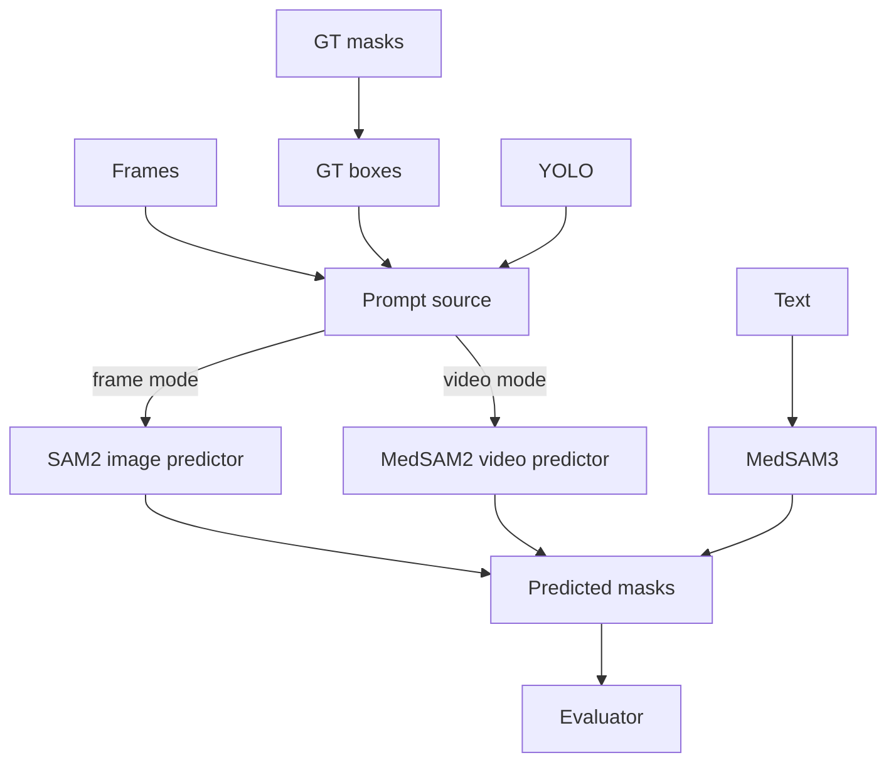
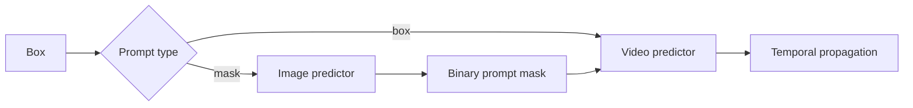
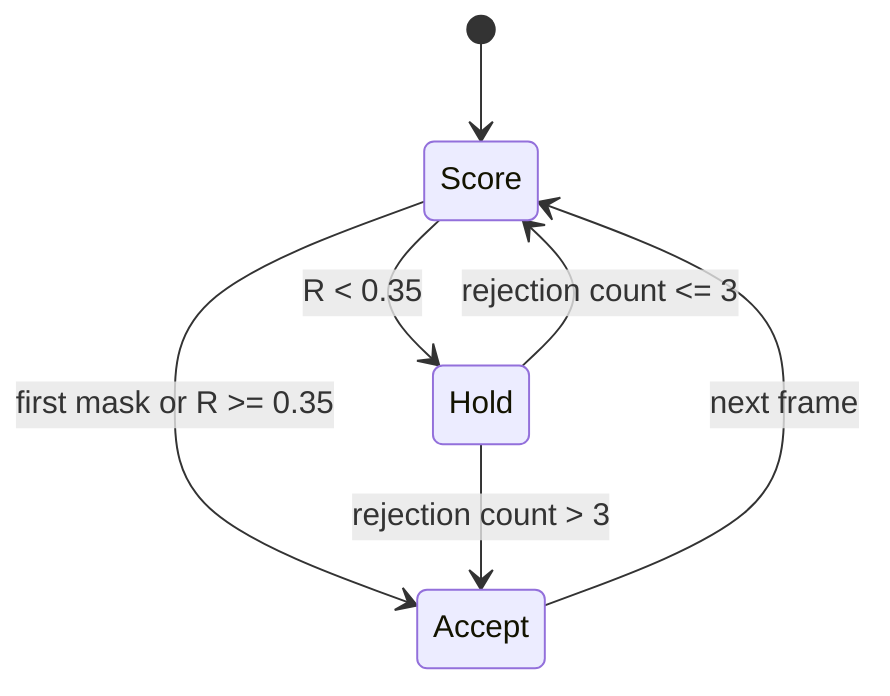

# Technical Reference

## Architecture



## Components

| File | Responsibility |
|---|---|
| `scripts/experiments/run_experiment.py` | Prepare, infer, evaluate |
| `scripts/utils/ground_truth_bbox_gen.py` | Mask → oracle box |
| `scripts/utils/eval_metrics.py` | Spatial and temporal metrics |
| `scripts/utils/failure_analysis.py` | Disconnects and timelines |
| `experiments/reliability_gated_memory_experiment.py` | Candidate, gate, report |
| `scripts/utils/reliability_gate.py` | Score and state transition |
| `scripts/utils/mask_utils.py` | Binary mask I/O |
| `external/` | Model implementations |

## Two entrypoints

| Item | Main benchmark | Reliability gate |
|---|---|---|
| Config | JSON | Python constants + CLI |
| Data | `data/polypgen` | `data/test/polypgen` |
| Boxes | `data/bbox` | `data/test/bbox` |
| Output | `outputs/<method>` | One isolated run root |
| Baseline | Multiple methods | Gated-only |

## MedSAM2 prompt flow



| Setting | Behavior |
|---|---|
| `stride=1` | Eligible every frame |
| `stride=5` | Indices 0, 5, 10, ... |
| `stride=10` | Indices 0, 10, 20, ... |
| `limit=1` | First successful prompt |
| `limit=0` | Unlimited |

An eligible frame without a box is skipped; the prompt is not shifted.

## Reliability gate

The gate selects saved masks. It does not modify SAM2 feature memory, attention, logits, or inference state.

| Signal | Weight | Definition |
|---|---:|---|
| Confidence | 0.35 | `0.5` proxy when unavailable |
| Temporal | 0.30 | IoU with prior accepted mask |
| Area | 0.25 | Exponential area-ratio consistency |
| Sharpness | 0.10 | Normalized Laplacian variance |

```text
R = 0.35·confidence + 0.30·temporal + 0.25·area + 0.10·sharpness
```

| Rule | Value |
|---|---:|
| Accept threshold | `0.35` |
| Blank-after-positive penalty | `× 0.25` |
| Implausible-area penalty | `× 0.50` |
| Valid area range | `0.0005–0.80` |
| Forced update | After 3 held masks |



Holding copies the previous mask without motion compensation.

## Gated output

```text
<run-root>/
  _candidate/
  gated/
    masks/seq*/predicted/
    logs/
    eval/
  metrics.csv
  summary.csv
  experiment_notes.json
  run.log
```

| File | Contents |
|---|---|
| `metrics.csv` | Per-frame mask, temporal, reliability, gate fields |
| `summary.csv` | Frame-macro run summary |
| `experiment_notes.json` | Runtime configuration |
| `run.log` | Console trace |

Missing predictions become blank masks. First-frame temporal metrics are `NaN`.

## Model notes

| Item | Value |
|---|---|
| MedSAM2 config | `sam2.1_hiera_t512.yaml` |
| Input size | 512 |
| Checkpoint | `MedSAM2_latest.pt` |
| Candidate device | CPU, MPS, CUDA, or auto |
| Objects | One |

## Known limits

| Limit | Impact |
|---|---|
| Constant confidence proxy | Weak calibration |
| Prior-mask similarity | Rewards persistence |
| No motion warp | Held mask can lag |
| Oracle GT prompts | Not fully automatic |
| Frame-macro gated summary | Long sequences dominate |
| PolypGen proxy | No clinical conclusion |
